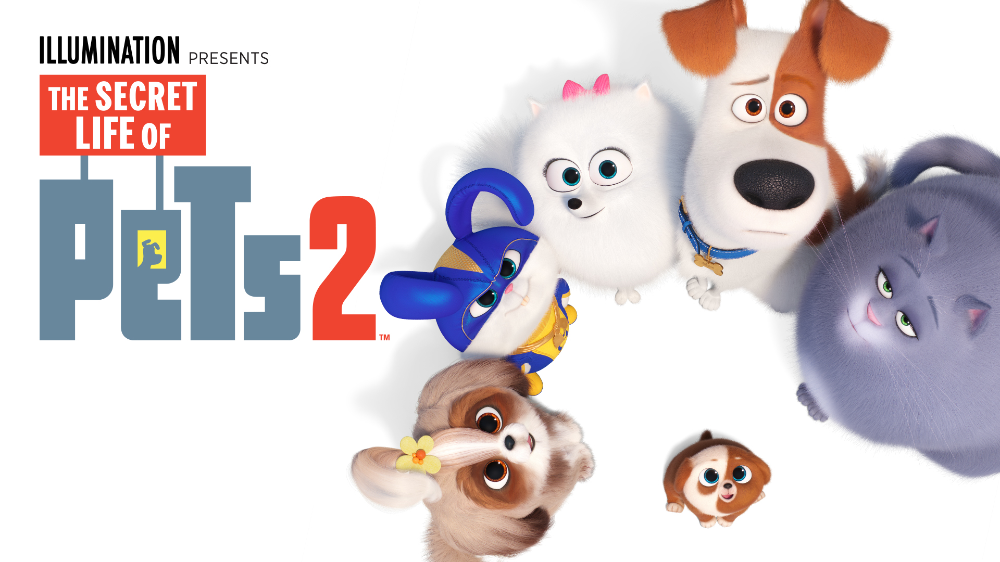

# 🐾 The Secret Life of Pets - Interactive Character Guide

## Overview
This project is an **interactive web experience** inspired by *The Secret Life of Pets* TV show and movies. The website introduces users to the beloved pets from the franchise and their owners.

Using **Object-Oriented Programming (OOP)** principles and **Parcel.js** for bundling, this project dynamically showcases each pet's details. When users click on a pet’s image, additional information about both the **pet** and their **owner** is revealed.

---

## Features
- 🐾 Explore familiar pets from *The Secret Life of Pets* universe.
- 🐕 **Filter system** to view pets by species (Dogs, Cats, Small Animals, Birds).
- 🧩 **OOP structure** with a parent `Pet` class and child classes (`Dog`, `Cat`, `SmallAnimal`, `Bird`).
- 👨‍👩‍👧 Each pet is linked to their **owner** using a separate `Owner` class.
- 🎬 Smooth **GSAP animations** when expanding pet profiles.
- 📱 Fully **responsive** across mobile and desktop using **CSS Grid** and **Flexbox**.

---

## Technologies Used
- **HTML5**
- **CSS3**
- **SASS**
- **JavaScript (ES6 Classes & Modules)**
- **Parcel.js** (bundler)
- **GSAP (GreenSock Animation Platform)**
- **CSS Grid & Flexbox** for responsive design

---

## How It Works
1. Users browse pet cards, each displaying the pet's name, species, age, image, and favorite toy.
2. Clicking on a pet's image reveals the pet’s larger profile along with their **owner’s photo** and a **fun description** of their relationship.
3. Filter buttons allow users to view pets by categories such as **Dogs**, **Cats**, **Small Animals**, or **Birds**.
4. Smooth animations provide an engaging experience.

## Installation
This is no installatin required, but should be opened with live server.

## Usage
Open index.html in the browser of your choice.

## Contributing
1. Fork it!
2. Create your feature branch: git checkout -b my-new-feature
3. Commit your changes: git commit -am 'Add some feature'
4. Push to the branch: git push origin my-new-feature
5. Submit a pull request :D

## History
February 5, 2025

## Credits
* Milana Gabbassova
* Dina Bondarchuk

## License
MIT License